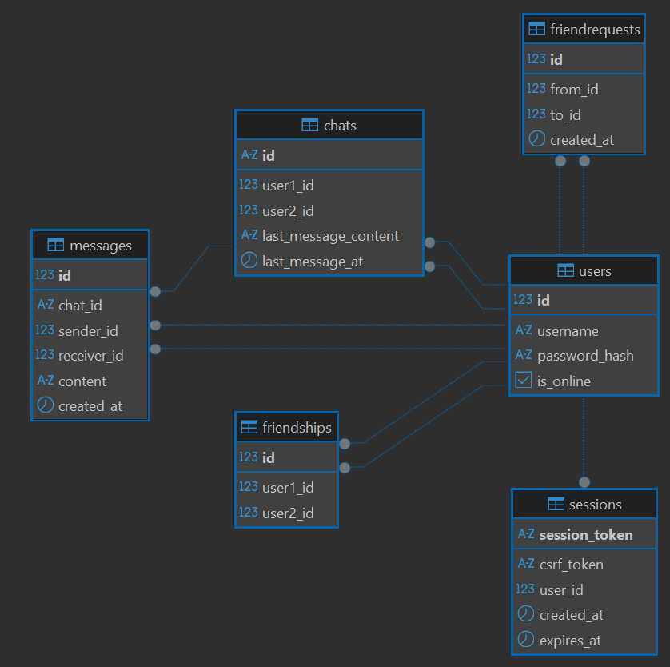

# Структура проекта

```
chat
├─ api.md
├─ architecture.md
├─ cmd
│  └─ chat
│     └─ main.go
├─ docker-compose.yaml
├─ docs
│  └─ diagram.png
├─ go.mod
├─ go.sum
├─ internal
│  ├─ core
│  │  ├─ domains
│  │  │  ├─ friendrequest.go
│  │  │  ├─ friendships.go
│  │  │  ├─ nullable.go
│  │  │  ├─ session.go
│  │  │  └─ user.go
│  │  ├─ errors
│  │  │  └─ errors.go
│  │  ├─ logger
│  │  │  ├─ config.go
│  │  │  └─ logger.go
│  │  ├─ server
│  │  │  ├─ http
│  │  │  │  ├─ config.go
│  │  │  │  └─ server.go
│  │  │  └─ ws
│  │  │     ├─ client.go
│  │  │     └─ server.go
│  │  ├─ store
│  │  │  └─ postgres
│  │  │     ├─ config.go
│  │  │     └─ postgres.go
│  │  ├─ transport
│  │  │  ├─ middleware
│  │  │  │  ├─ common.go
│  │  │  │  ├─ middleware.go
│  │  │  │  └─ protected.go
│  │  │  ├─ repsponse
│  │  │  │  ├─ dto.go
│  │  │  │  └─ response.go
│  │  │  └─ request
│  │  │     ├─ decode.go
│  │  │     ├─ method.go
│  │  │     ├─ pathvalue.go
│  │  │     └─ queryparam.go
│  │  └─ utils
│  │     └─ context.go
│  └─ features
│     ├─ friendrequests
│     │  ├─ respository
│     │  │  └─ repository.go
│     │  ├─ service
│     │  │  └─ service.go
│     │  └─ transport
│     │     ├─ http
│     │     │  ├─ dto.go
│     │     │  └─ transport.go
│     │     └─ ws
│     │        ├─ dto.go
│     │        └─ transport.go
│     ├─ friendships
│     │  ├─ repository
│     │  │  └─ repository.go
│     │  ├─ service
│     │  │  └─ service.go
│     │  └─ transport
│     │     ├─ http
│     │     │  ├─ dto.go
│     │     │  └─ transport.go
│     │     └─ ws
│     │        ├─ dto.go
│     │        └─ transport.go
│     ├─ sessions
│     │  ├─ repository
│     │  │  └─ repository.go
│     │  ├─ service
│     │  │  └─ service.go
│     │  └─ transport
│     │     └─ http
│     │        ├─ dto.go
│     │        └─ transport.go
│     └─ users
│        ├─ repository
│        │  └─ repository.go
│        ├─ service
│        │  └─ service.go
│        └─ transport
│           ├─ http
│           │  ├─ dto.go
│           │  └─ transport.go
│           └─ ws
│              ├─ dto.go
│              └─ transport.go
├─ Makefile
├─ migrations
│  ├─ 000001_init.down.sql
│  └─ 000001_init.up.sql
└─ readme.md

```

# Схема БД (5 таблиц)

| Таблица            | Первичный ключ                 | Описание                                                    |
| -----------------  | ------------------------------ | ----------------------------------------------------------- |
| **users**          | `id` (GENERATED)               | Пользователь (хранит информацию о пользователе)             |
| **sessions**       | `session_token` (VARCHAR(255)) | Сессия пользователя (хранит файлы cookie + ID пользователя) |
| **friendships**    | `id` (GENERATED)               | Друзья (хранит информацию о дружественных связях между пользователями) |
| **friendrequests** | `id` (GENERATED)               | Заявки в друзья (хранит информацию о том, кто и кому отправил звявку в друзья) |
| **chats**          | `id` (GENERATED)               | Чаты (хранит информацию о чатах) |
| **messages**       | `id` (VARCHAR(100))            | Сообщениея (хранит информацию об отправленных сообщениях) |

## Диаграмма



## Примечание

### Денормализация в таблице `messages`

В таблице `messages` существует поле `receiver_id`, несмотря на то, что мы можем найти получателя через таблицу `chats` с помощью операции **JOIN** (поскольку `chats` хранит `user1_id` и `user2_id`). Решение добавить данное поле было принято для **оптимизации под чтение**.

### Денормализация в таблице `chats`

Поля `last_message_content` и `last_message_at` дублируют данные из последнего сообщения в чате. Это позволяет отображать список диалогов без `JOIN` с `messages`, быстро получать превью последнего сообщения, cортировать диалоги по времени последней активности