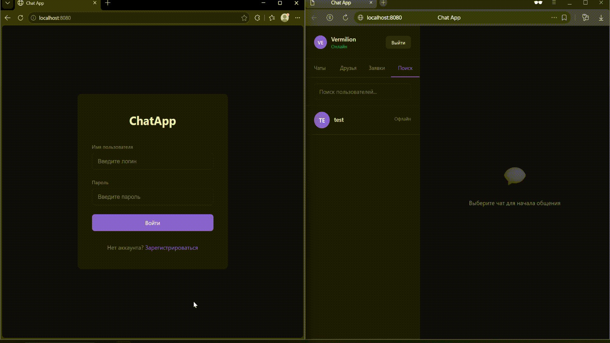
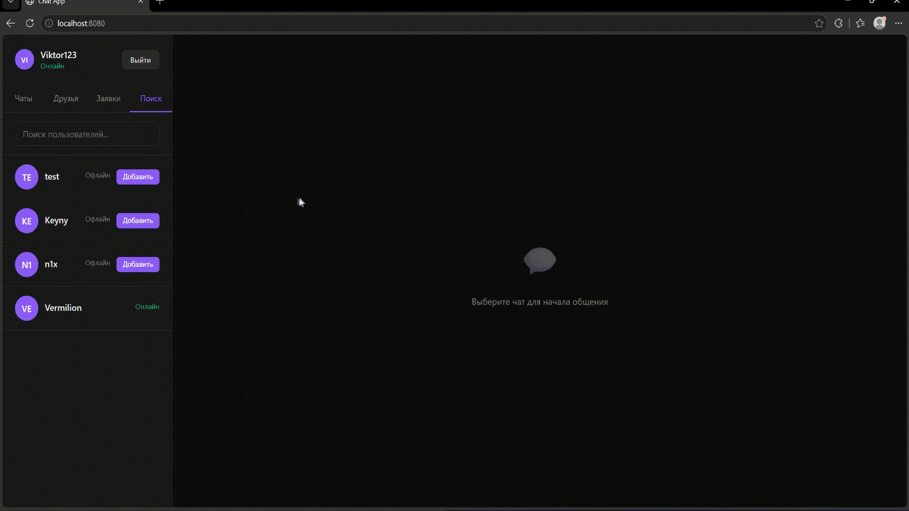
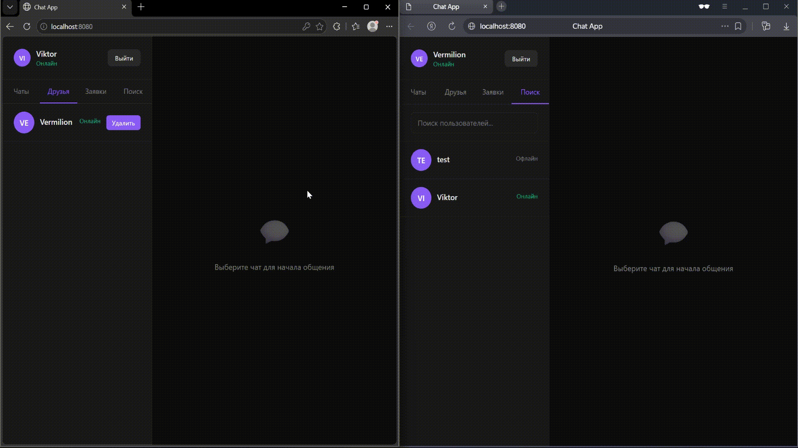
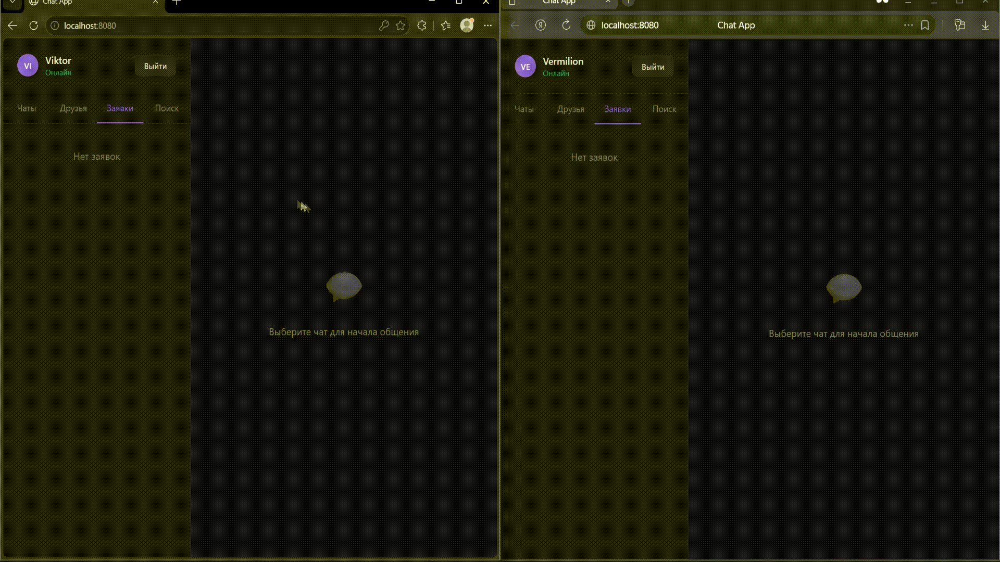
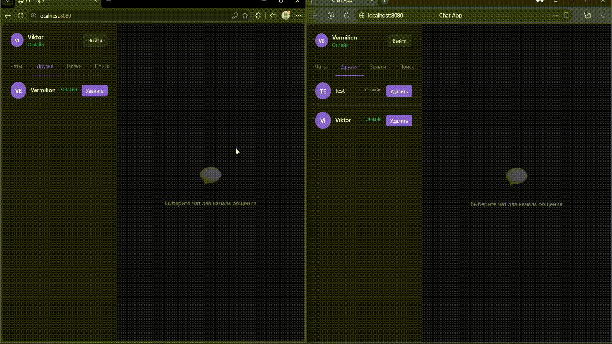
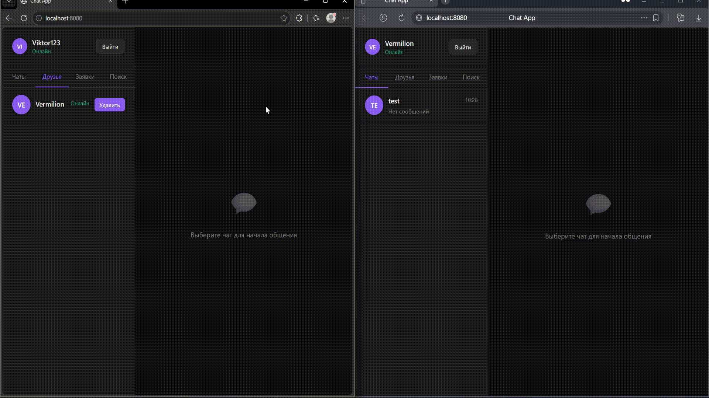
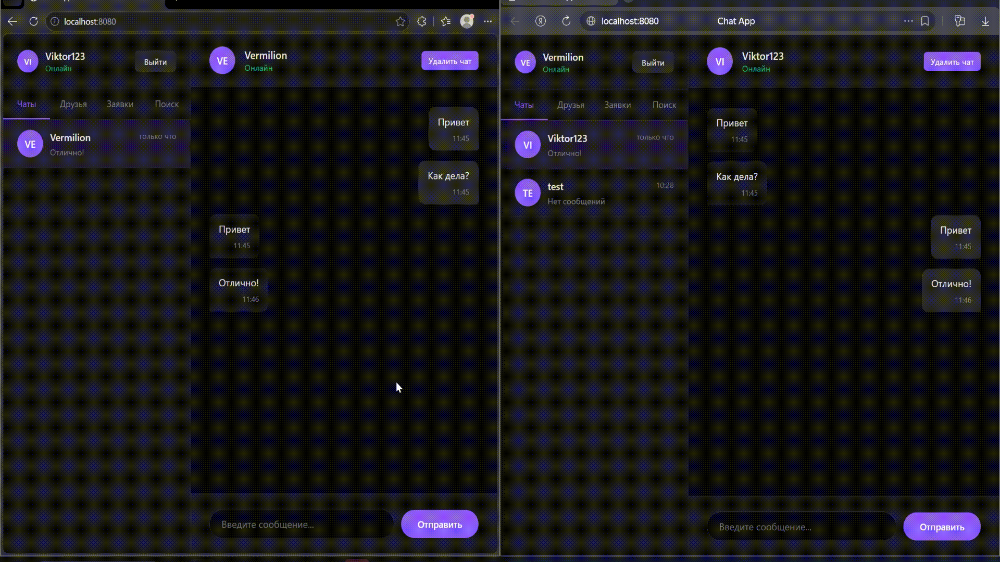

# WEBSOCKET CHATAPP


Веб-приложение one-to-one чат, разработанное по принцам REST API и использующее протокол WebSocket для real-time уведомлений

## Функционал

- Регистрация/аутентификация пользователя
- Поиск пользователей
- Редактирование профиля
- Отправление/отклонение/принятие заявок в друзья
- Удаляение пользователей из списка друзей
- Переписка с друзьями
- Удаление чата с другом

## Технологический стэк

- **GOLANG** - backend
- **HTML** + **CSS** + **JS** - frontend
- **PostgreSQL** - хранение данных
- **Migrate** - инструмент для управления миграциями баз данных
- **Makefile** + **Docker** - сборка проекта 

## Установка и запуск

### Требования

- [Migrate](https://github.com/golang-migrate/migrate)
- [Docker](https://www.docker.com/get-started/)

### Как запустить

1. **Создайте** переменные окружения в `.env` в корневой папке проекта:

```properties
POSTGRES_USER=chat-user
POSTGRES_PASSWORD=chat-password
POSTGRES_DB=chat
POSTGRES_HOST=localhost
POSTGRES_PORT=5432
POSTGRES_TIMEOUT=10s

HTTP_ADDR=:8080
HTTP_TIMEOUT=30s

LOG_LEVEL=DEBUG
```

2. **Запустите**:

```bash
make env-up && \
make migrate-up && \
make app-deploy
```

3. **Откройте** в браузере ссылку http://localhost:8080/

## Демонстрация работы приложения

### Регистрация и аутентификация пользователя



### Поиск пользователей



### Редактирование профиля



### Отправление, отклонение и принятие заявки в друзья



### Удаление пользователя из списка друзей



### Переписка с другом



### Удаление чата с другом



# Документация

- [Архитектура проекта](architecture.md) - структура, схема базы данных
- [API References](api.md) - описание доступных эндпоинтов, WebSocket событий, примеры запросов/ответов
